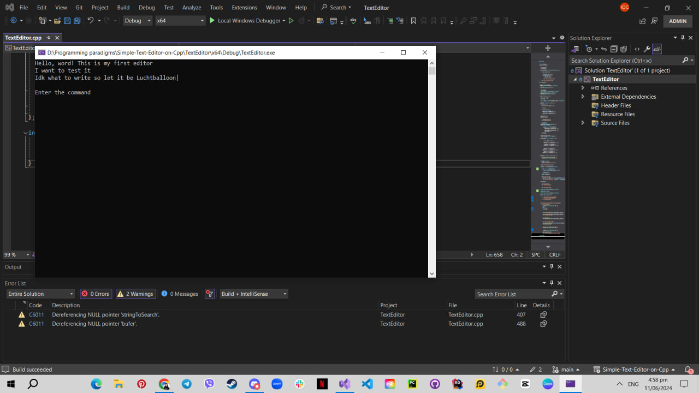
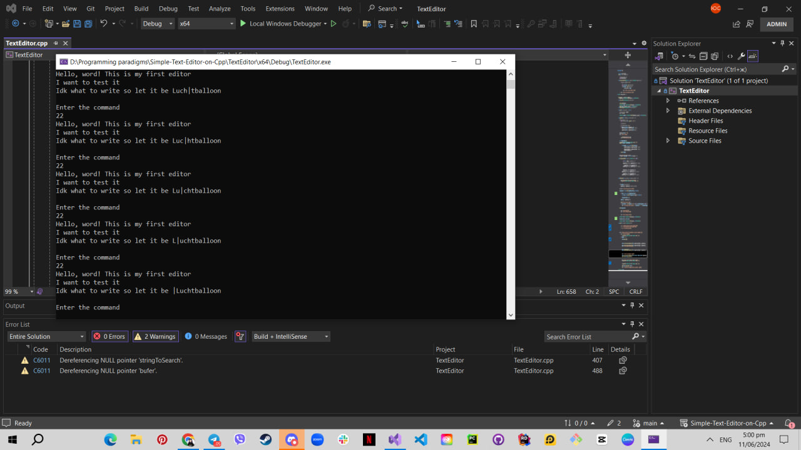
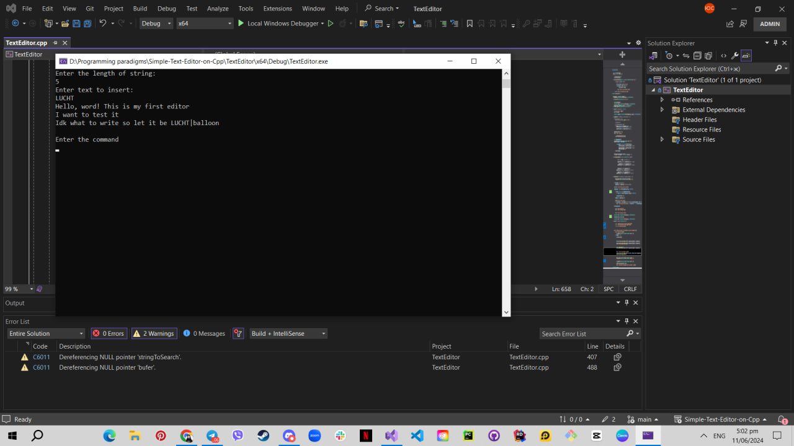
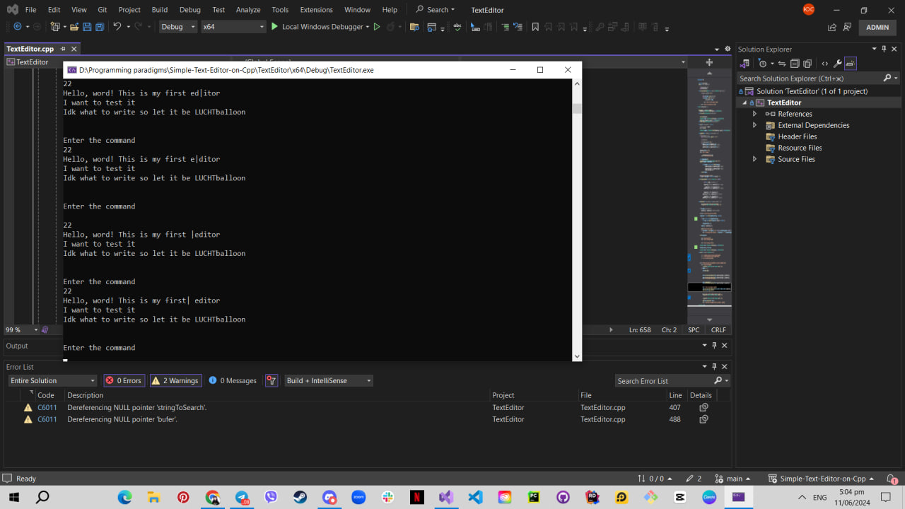
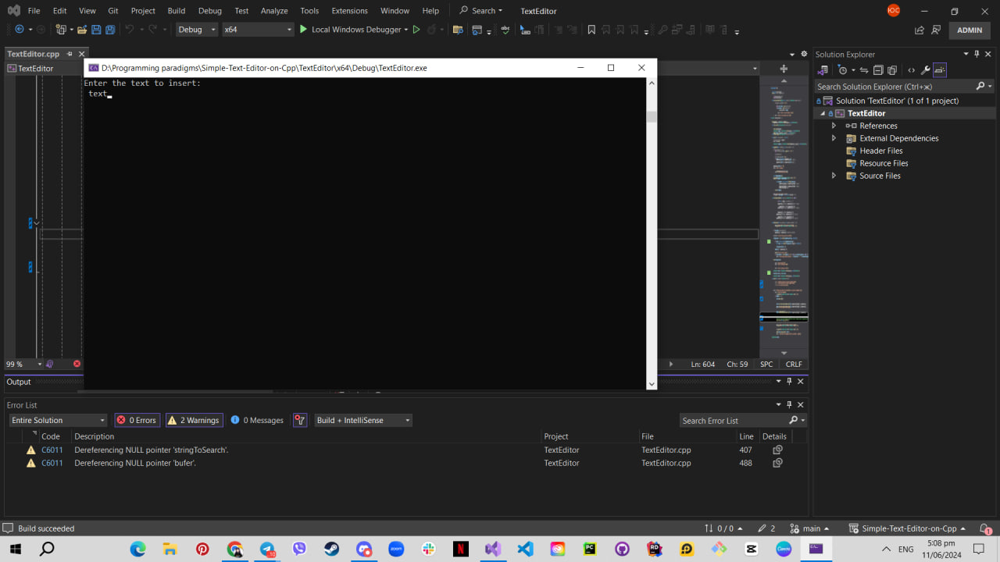
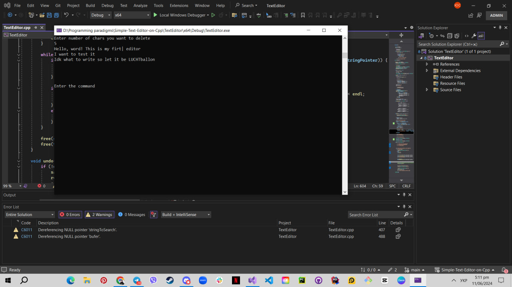
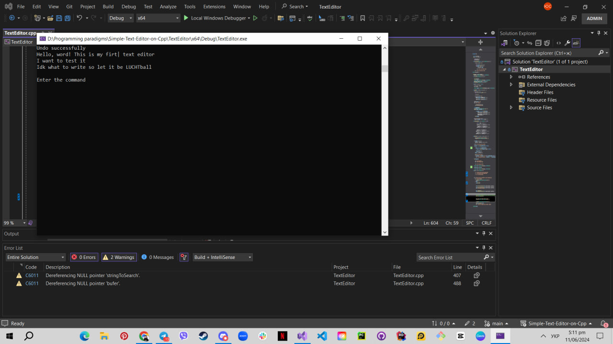
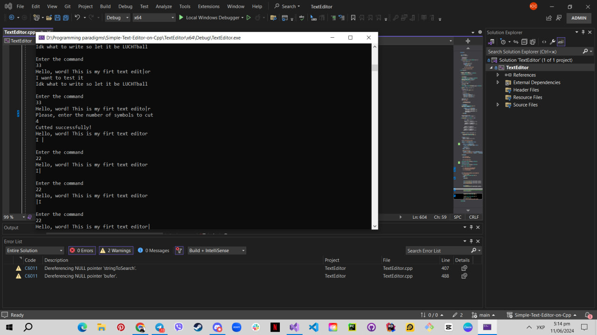
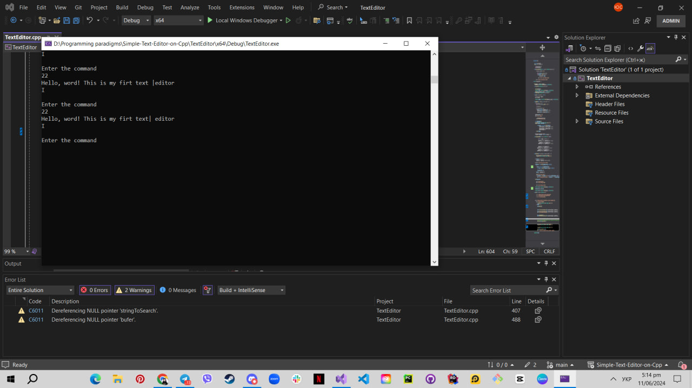
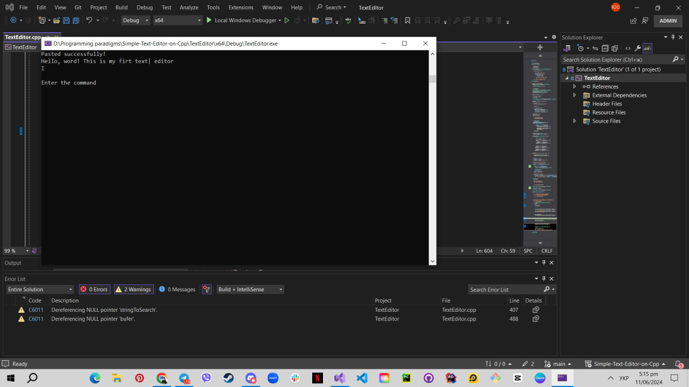

# Simple-Text-Editor-on-Cpp

## Test Plan

### 1. Append 3 Lines of Text
- **Action:** Enter text three times, each time pressing "1" and then pressing "2" to start a new line.
- **Expected Result:** Three lines of text are appended.
- **Verification:** 

### 2. Move Cursor
- **Action:** Use the command to move the cursor to a specific position.
- **Expected Result:** Cursor moves to the specified position.
- **Verification:** 

### 3. Insert With Substituting
- **Action:** Insert text that substitutes the existing text at the cursor position.
- **Expected Result:** New text replaces the existing text at the cursor position.
- **Verification:** 

### 4. Move Cursor
- **Action:** Use the command to move the cursor to a different position.
- **Expected Result:** Cursor moves to the new specified position.
- **Verification:** 

### 5. Insert Without Substituting
- **Action:** Insert text without substituting the existing text at the cursor position.
- **Expected Result:** New text is inserted, and existing text is shifted accordingly.
- **Verification:** 

### 6. Delete Text
- **Action:** Use the command to delete text from the cursor position.
- **Expected Result:** Text is deleted from the cursor position.
- **Verification:** 

### 7. Undo
- **Action:** Press "11" to undo the last action.
- **Expected Result:** The last action is undone.
- **Verification:** 

### 8. Move Cursor
- **Action:** Use the command to move the cursor again.
- **Expected Result:** Cursor moves to the specified position.
- **Verification:** 

### 9. Cut Text
- **Action:** Use the command to cut text from the cursor position.
- **Expected Result:** Text is cut and removed from the cursor position.
- **Verification:** 

### 10. Move Cursor
- **Action:** Use the command to move the cursor to another position.
- **Expected Result:** Cursor moves to the new specified position.
- **Verification:** 

### 11. Paste
- **Action:** Use the command to paste the previously cut text.
- **Expected Result:** Text is pasted at the cursor position.
- **Verification:** 

### 12. Redo
- **Action:** Press "12" to redo the last undone action.
- **Expected Result:** The last undone action is redone.
- **Verification:** 

## README

This document provides a comprehensive test plan for validating the text manipulation functionalities of the system.

### Prerequisites
- Ensure the application is running.
- Have the necessary permissions to read/write files.

### Instructions
1. Follow the steps sequentially as outlined in the test plans.
2. Compare the expected results with the actual results.
3. Use the provided images for visual verification.

### Notes
- Ensure that all necessary screenshots are taken during the testing process for accurate verification.
- Report any discrepancies between the expected and actual results.

### Commands
- **^1** - Append text symbols to the end
- **^2** - Start the new line
- **^3** - Print the current text
- **^4** - Load the text to file
- **^5** - Load the text from file
- **^6** - Substitute string by line and text symbol index
- **^7** - Search text
- **^8** - Print the command list
- **^9** - Insert string by line and text symbol index
- **^10** - Delete string from cursor position
- **^11** - Undo command
- **^12** - Redo command
- **^13** - Copy from cursor position
- **^14** - Cut from cursor position
- **^15** - Paste text from buffer
- **^-1** - Quit the program
